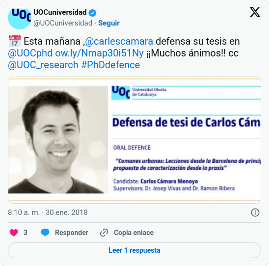
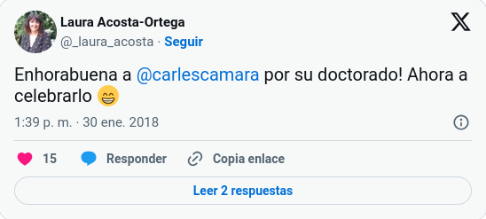
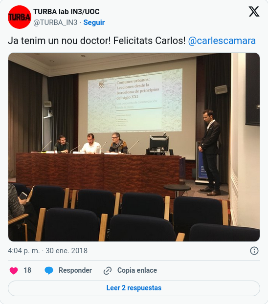
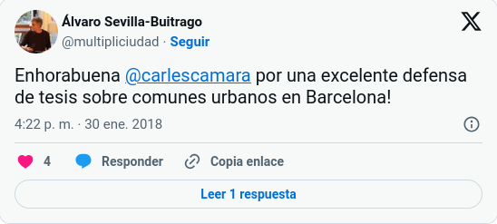
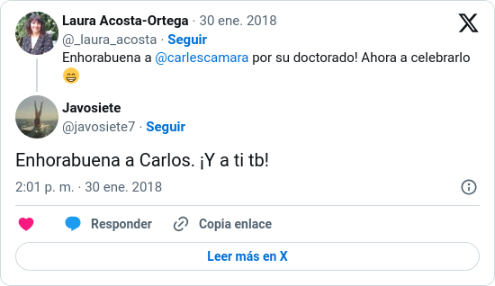
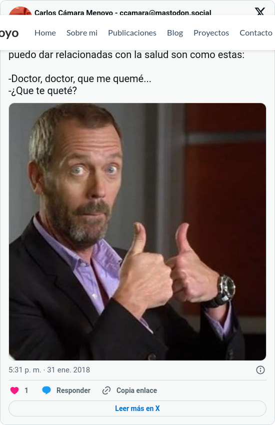

+++
title = "¡Soy doctor!"
date = 2018-02-05T23:10:07+01:00
draft = false

# Tags and categories
# For example, use `tags = []` for no tags, or the form `tags = ["A Tag", "Another Tag"]` for one or more tags.
tags = ["UOC", "tesis", "doctorado"]
categories = ["General"]
people = ["Carlos Cámara", "Ramon Ribera", "Pep Vivas", "Jorge León"]
projects = ["urban-commons"]

# Featured image
# Place your image in the `static/img/` folder and reference its filename below, e.g. `image = "example.jpg"`.
# Use `caption` to display an image caption.
#   Markdown linking is allowed, e.g. `caption = "[Image credit](http://example.org)"`.
# Set `preview` to `false` to disable the thumbnail in listings.
[header]
[image]
placement = 3
# Caption (optional)
caption = "Tratando de relajarme un poco mientras el presidente da inicio a la defensa. Foto: Ramon Ribera"

# Focal point (optional)
# Options: Smart, Center, TopLeft, Top, TopRight, Left, Right, BottomLeft, Bottom, BottomRight
focal_point = "Smart"

[[gallery_item]]
album = "1"
image = "post/doctorado/DSCF6942.JPG"
caption = "Directores y tribunal saboreando el piscolabis."

[[gallery_item]]
album = "1"
image = "post/doctorado/DSCF6940.JPG"
caption = "Enseñándoles a mi madre Mapi y Laura la toalla regalo de la familia Andrés."

[[gallery_item]]
album = "1"
image = "post/doctorado/DSCF6929.JPG"
caption = "Algunos de mis compañeros de TURBA conociendo a Laura."

[[gallery_item]]
album = "1"
image = "post/doctorado/DSCF6941b.JPG"
caption = "Juan, Xavier, Cristina, mi padre Javier y Noa."

+++

El pasado martes 30 de enero de 2018 tuvo lugar uno de los días más especiales de mi vida: defendía mi tesis doctoral, marcando de este modo el fin de una etapa y, a la vez, el inicio de una nueva. Digo que fue especial no tanto porque sea uno de los mayores hitos dentro del mundo académico, sino porque tenía la oportunidad de contar la investigación a la que he dedicado los últimos 5 años (sobre todo por las noches y en vacaciones) ante un tribunal que, así se hizo evidente enseguida, había leído con detenimiento las más de 400 páginas en las que explico el proceso y los resultados obtenidos, y ante una audiencia inmejorable: rodeado de familiares, amigos, compañeros de trabajo e, incluso, alguna cara desconocida[^ausencias]. Fue un día tan especial que escribo este post, no tanto por querer compartirlo (que también), sino porque fue un recuerdo tan bonito que quiero poder leerlo (y recordarlo) en el futuro. Entenderéis que este texto sea algo más personal y largo que lo habitual y que quiera empezar por el principio.<!-- more -->

Había dormido bien, muy bien. El día empezaba como muchos otros días (quienes me conocen saben que tengo el don de poder dormir bajo casi cualquier circunstancia), aunque es cierto que me desperté 20 minutos antes de que sonase el despertador. Tampoco hubo grandes cambios en mi rutina, más allá de que en lugar de empezar con el desayuno, me abalancé al ordenador para añadir una imagen nueva a las diapositivas y cambios menores en la presentación que había estado preparando durante la última semana con mimo y con la ayuda de mis compañeros del grupo de TURBA[^turba]. Supongo que algo habría soñado al respecto la noche anterior, pero no lo recuerdo (no suelo recordar mis sueños: para mí, las noches, símplemente no existen). Hechos los cambios pertinentes, desayuné, tomé unas notas de lo que imaginaba que podría preguntarme el tribunal (no acerté demasiado) y puse a mirar las copias impresas de la tesis para relajarme[^tesis-impresa].



Como la lectura en diagonal no servía para apaciguar los nervios que ya habían empezado a hacer acto de presencia (supongo que aún estaba muy presente el último ensayo que hice la tarde anterior, que me salió un poco *meh*), decidí ducharme, vestirme[^ropa] e ir a la [sede central de la UOC](https://www.openstreetmap.org/relation/7935355) para comprobar que la presentación se vería bien[^preparativos], a fin de cuentas tenía claro que no haría nada bueno en casa. Así pues, me despedí de Laura, que se quedaría a esperar a mis padres para llevar en coche a mi sobrina de 7 meses y a los preparativos para el pica-pica que habíamos dejado preparados la noche anterior, y tomé el metro. De camino a la universidad aproveché el viaje en metro para mirar el móvil, donde no solo amigos y familiares habían empezado a mandarme sus mejores deseos, sino que la propia escuela de doctorado lo hacía por twitter. Un detalle muy bonito que me animó el trayecto un poco más.

Llegué a mi destino con algo más de una hora de antelación y me dediqué a montar mi ordenador, conectarlo al proyector y comprobar con horror que ni se proyectaba en la pantalla ni había un enchufe cerca para asegurarme de tener autonomía suficiente para una sesión que prometía ser larga. Afortunadamente, nada que no pudiese solucionar el simpático y eficiente técnico de la UOC. Mientras él trabajaba por solucionar esos problemas, fue llegando mi familia: Laura, mis padres y Noa fueron los primeros. Al rato llegaron Cristina y Xavier, y algo más tarde mi tío Juan en representación de mi familia de Reus. También fueron llegando Mireia Flaquer, de la secretaría de la escuela de doctorado, para contarme cómo funcionaría el acto y preparar la grabación del vídeo que le pedí. Y a falta de algo más de media hora de la hora de la defensa (o quizá más, hacía rato que había dejado de mirar el reloj), llegaron mis tutores, **Pep** y **Ramon**, con quienes bromeamos un poco para rebajar la tensión mientras esperábamos al tribunal. El primero en llegar fue el presidente, **Federico de María**, en sustitución de **Nuria Benach**, que por motivos de salud fue baja de última hora. Tras presentarse me dedicó unas palabras que me sirvieron para relajarme considerablemente y que le agrezco enormemente[^fede]. Algo similar hizo **Álvaro Sevilla-Buitrago**[^alvaro], al llegar de Madrid y antes de renuirse con **Hug March** (luego supe que estaban intercambiando opiniones y repartiendose las intervenciones que harían durante mi evaluación). Esos minutos de espera los fui pasando como pude hablando con todos aquellos que se habían acercado a acompañarme, sacándome fotos... hasta que llegó la hora de la verdad y entraron los miembros del tribunal al ritmo en el que mi corazón se aceleraba.



El acto empezó puntualmente. Tras una breve presentación del tribunal, formado por **Federico de María** (presidente, UAB), **Hug March** (vocal, UOC) y **Álvaro Sevilla-Buitrago** (secretario, UPM) por parte de su presidente dio comienzo mi presentación. Tenía por delante 40 minutos en los que contar cómo había sido el proceso de la tesis y el proceso personal que, a través del hilo conductor de los comunes urbanos, me había llevado a dar sentido y coherencia a intereses tan aparentemente dispares e inconexos como son la arquitectura, el urbanismo, el software y la cultura libre, la economía, ecología e incluso la política. Aunque empecé un poco acelerado y nervioso, medida que pasaba el tiempo me iba sintiendo cada vez más a gusto y las palabras acudían a mi sin necesidad de mirar las numerosas notas y ayudas que me había anotado en el monitor auxiliar. Durante esos minutos hablé del **contexo** de la crisis y el papel que juegan las ciudades y, más concretamente, los comunes urbanos en todo ello; del **marco teórico** y de las tres tradiciones que dan lugar al imaginario y discurso de los comunes urbanos; de la **metodología** empleada; los **resultados** obtenidos; así como lo que considero han sido las principales **contribuciones y los retos de futuro** que me deparan. Me sentí tan a gusto que esta parte se me hizo muy corta a pesar de que me ceñí perfectamente al tiempo y apenas me olvidé de decir nada (incluso tuve tiempo de añadir anécdotas que no había previsto). Tan solo espero que los asistentes se sintiesen tan a gusto como yo.



Tras mi conferencia, volvieron a subir el estrado los miembros del tribunal e iniciaron sus respectivas intervenciones. Habíamos acordado previamente que harían sus intervenciones seguidas y, posteriormente, respondería a sus preguntas de forma agrupada. Este era el momento que más temía y a la vez esperaba con más ganas: no tanto por masoquismo, sino por aprovechar el conocimiento y la digestión que habían hecho de mi trabajo tres personas que son excepcionales en sus respectivas áreas y de las que sin duda espero aprender (y seguir aprendiendo) mucho. Y, efectivamente, así fue. Empezó **Álvaro** y lo expuso muy claramente: la lectura de mi tesis le había suscitado interés e, incluso, nuevas dudas, y con sus intervenciones esperaba provocarme nuevas dudas y trasladarme aquellos aspectos que no le habían quedado claros o, simplemente discrepaba. **Hug** fue el siguiente, haciendo gala de su habitual visión crítica y centrándose especialmente en aspectos metodológicos y haciendo preguntas muy directas y concretas. Finalmente, **Federico** cerró el turno de intervenciones aportando una mirada fresca que, sin duda, abría nuevas lecturas y líneas de trabajo de la investigación. Tras unos 10 minutos de preparación de respuestas(y de descanso para los asistentes), me dispuse a agradecer las generosas palabras de elogio que también me había dedicado el tribunal y, especialmente, dar respuesta a las preguntas que me habían planteado. Aunque disfruté mucho de este momento y respondí a buena parte de ellas (algunas mejor que otras -todavía le sigo dando vueltas a la pregunta de Álvaro sobre la dimensión urbana de los comunes urbanos-), al día siguiente me vinieron a la mente nuevas respuestas e, incluso, preguntas que olvidé responder a pesar de que lo había ido anotando todo en mi libreta. Sea como fuere, este fue, uno de los momentos que más disfruté. No solo tuve la oportunidad de explicar aspectos no había podido contar en la presentación, que estaban meramente enunciadas como notas al pie en la memoria o simplemente no había contado nunca, sino que me plantearon muchos retos de futuro que espero poder seguir desarrollando. Tal y como diría Pep minutos más tarde, fueron unos minutos de discusiones muy enriquecedoras en las que se respondían preguntas e, inevitablemente, se abrían otras.



Finalmente, cuando el tribunal se dio por respondido, dio paso a intervenciones desde el público. Aquí vino la mayor sorpresa del día: las emotivas palabras de mis directores, **Ramon Ribera** y **Pep Vivas**[^jorge]. Cada uno a su manera (Ramon señalando las circunstancias -un tanto adversas- en las que había desarrollado la tesis y los buenos resultados obtenidos, y Pep, como buen Psicólogo social, apelando a la dimensión humana y personal de la investigación) consiguieron emocionarme hasta el punto de que si bien pude mantener la compostura como pude en el estrado, rompí en lloros de emoción y alegría minutos más tarde, mientras el tribunal deliberaba. Sus intervenciones confirmaban, de este modo, que además de ser grandes profesionales de los que he aprendido muchísimo y espero seguir haciéndolo en el futuro, son mejores personas con una gran calidad humana con las que espero seguir compartiendo mi tiempo[^directores].

<!--  -->

Tras las intervenciones de mis directores, el tribunal se dispuso a deliberar. Momento que mis padres y Laura aprovecharon para montar una mesa con piscolabis para los asistentes. También aproveché para abrazarme con todos, y hablar con aquellos con quienes no había podido hacerlo hasta ahora. No sé cuanto duró la espera (el trabajo ya estaba hecho y solo me quedaba disfrutar), pero tras varios minutos el tribunal nos llamó de nuevo y procedió a leer el acta, dando por finalizada la evaluación y obteniendo, ahora sí, mi **calificación de Doctor en Sociedad de la Información y el Conocimiento**[^cristina].

> Ya me estáis felicitando a @carlescamara que es desde ayer DOCTOR ARQUITECTO. Enhorabuena amigo!
> — Jose Mª Echarte (@j_echarte) January 31, 2018

Y aunque el día continuó con una comida con directores y miembros del tribunal, un paseo de 3km con Laura, y una merienda cena con mi familia (ahora sí, casi al completo) en casa, eso me lo guardo para mí y solo añadiré lo que imagino que ya suponéis: fueron momentos muy felices, de besos y abrazos. Bueno, eso y que cuando nos quedamos solos en casa y me senté en el sofá a eso de las 21:00, me sobrevino de golpe un cansancio similar al de haber corrido una maratón del que todavía no he conseguido recuperarme del todo. Y así fue, *grosso modo*, mi día. Un día que espero recordar siempre como uno de los momentos más especiales de mi vida. Solo me queda agradecer a todas aquellas personas que habéis hecho posible que llegase este momento. Y es que, aunque esta tesis la firmo yo, es el resultado colectivo de muchas personas sin las cuales ni ella ni yo mismo estaríamos ahora donde estamos.



**Addendum:** Y no podía terminar el post de otra forma, con un chiste propio para la ocasión ("El" chiste, como le llama Laura) y una nota mental o recordatorio a modo de cura de humildad en forma de tira cómica:

[^ausencias]: Agradezco también a quienes, a pesar de no poder asistir por motivos de agenda, distancia, laborales... me hicieron llegar su apoyo desde la distancia, y que estuvieron, por tanto, presentes en espíritu.
[^turba]: Agradezco (ya advierto que van a salir muchos agradecimientos en este post) a mis tutores Pep y Ramon y a mis compañeros del grupo [TURBA](http://turbain3.wordpress.com) el ensayo de la defensa que pude hacer con ellos y los comentarios que me hicieron llegar, tanto en el ensayo, como después de modificarla. Gracias a sus comentarios la presentación final fue muchísimo mejor que la que escucharon ellos por primera vez y, más importante si cabe, no duró 1hora y 10 minutos (30 minutos más del tiempo de la defensa), lo cual hubiese sido inadmisible, además de soporífero.
[^tesis-impresa]: Tengo que reconocer que la sensación de ver la tesis impresa y encuadernada por primera vez fue increíble. Hoy, una semana más tarde, todavía me sigo emocionando cuando la veo en casa (incluso a pesar de haber detectado problemas de impresión y maquetación).
[^preparativos]: Al miedo escénico de cualquier orador que dependa de una presentación en ordenador, hay que sumarle el hecho de utilizar una presentación hecha en LibreOffice y con tipografías específicas que, tanto uno como el otro, no suelen estar instaladas en todos los ordenadores, lo cual me obliga a utilizar mi portátil con Kubuntu. Y aunque no vivo tan al límite y llevaba un plan B consistente en un PDF con fuentes incrustadas, se perdían las transiciones y las notas que me había puesto con frases para dar entrada a las diapositivas o ayudarme en los momentos en los que me suelo encallar.
[^ropa]: A pesar de que en sus últimos correos, mis dos tutores me instaban con una insistencia entre sospechosa y jocosa a que me comprase un traje para la ocasión (era la muletilla final de todos sus correos), no les hice caso y elegí un *outfit* un poco menos "arreglao" (aunque mucho más de lo que suelen ser mis estándares).
[^fede]: Así como lamento que Nuria Benach no pudiese venir (espero que se recupere pronto y que tengamos ocasión de conocernos y debatir), agradezco a Federico no solo que resolviese su papel a la perfección sino que se leyese la memoria en tan poco tiempo. También le agradezco las primeras palabras que me dirigió, algo así como que se habían leído la tesis y consideraban que era buena, que me relajase y disfrutase de mi día, y que no me preocupase por las críticas que seguro las habría, porque todas serían con ánimo de construir. No sé si es lo habitual en estas ocasiones, pero, insisto, me ayudaron mucho a relajarme.
[^alvaro]: Agradezo también a Álvaro Sevilla que aceptase formar parte del tribunal incluso a pesar de su apretada agenda. En su caso me hacía especial ilusión conocerle (a la vez que me infundía un enorme respeto y temor) dado que, en el decurso de la investigación, había aprendido mucho de la lectura de varios de sus numerosos artículos sobre comunes e historia del urbanismo y la planificación.
[^jorge]: Tengo que destacar también el papel de **Jorge León** como tercer tutor, que excedió con creces su papel como compañero en la Universidad San Jorge, y me demostró su gran calidad humana y profesional. Lamentablemente no pudo estar presente en el acto, aunque lo estuvo también en espíritu.
[^directores]: Esta es otra de las cosas positivas de hacer una tesis y que sin embargo no he sido capaz de ver hasta terminarla: la oportunidad que supone estar en contacto, trabajar y aprender y compartir numerosas horas con personas, como los directores, con las que se llegan a compartir intereses académicos e incluso, más. Forjándose, de este modo, una relación muy bonita que va más allá de lo meramente profesional. Algo similar ocurre con los compañeros de trabajo, tanto en la [Universidad San Jorge](http://usj.es), como en el grupo de investigación [TURBA](http://turbain3.uoc.edu) de la [UOC](http://uoc.edu).
[^cristina]: Aunque, tal y como me señaló oportunamente Cristina, en estos momentos es más correcto decir que soy doctor condicionado. Condicionado a pagar las tasas de expedición del título.
